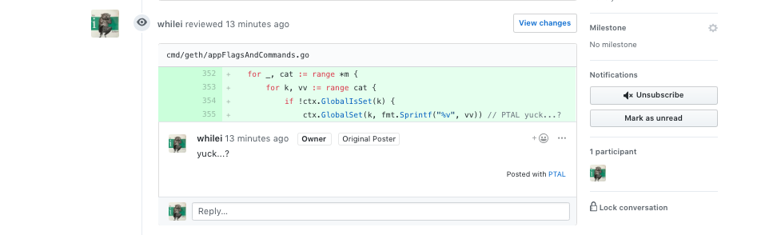

## `// PTAL This should be automated`

This is a small script to post comments from code (specifically, code _diffs_),
as pull request comments.

Like this:



This kind of thing can be helpful to draw reviewers'
attention, and generally speaking, to make specific code changes, opinions, problems,
or questions more public than Github GUI's interface currently encourages.

This began as a gist,
[here](https://gist.github.com/whilei/54758c05e7355130ce95127645415efa).

### Install

```shell
# (This assumes that $HOME/bin is already in your $PATH.)
$ curl -o $HOME/bin/PTAL https://github.com/whilei/PTAL/raw/master/PTAL && \
chmod +x $HOME/bin/PTAL
```

### Use

```shell
# Go to your repo you're making a PR from.
$ cd /your/repo

# Parse the diff for relevant comments and POST em for profit.
$ PTAL -h
--------------------------
>>> Usage

  -d <dry run> (don't actually make the POST request, just echo what would happen)
  -p 123 <pull request id>
  -r whilei/go-ethereum <github :owner/:repo>
  -b master <git branch to diff against>
  -c 288ed4c6fc5768b452c0b388145d3a26feb57bad <commit hash> Default: `git rev-parse HEAD`
  -o PTAL <delimiter for single-line comments>   Default: PTAL
  -m PTAL- <delimiter for multi-line comments>   Default: PTAL-

eg. $ PTAL -p 123 -r whilei/go-ethereum -d

>>> A couple examples for how to use comments in the code to be postable:

  1.

// PTAL I don't understand where this variable comes from. :eyeglasses:


  2.

// PTAL-//
// Um, actually,
// I don't understand...
// anything.
// PTAL-

```


